

# 🏥 蝉印诊所管家

---

## 📖 项目简介

蝉印诊所管家专为消费医疗行业打造，全面覆盖医美、口腔、眼科及各类诊所等应用场景。我们致力于推动中国消费医疗行业信息化发展。

---

## 🌐 在线演示

### 租户运营平台演示地址
请安装系统体验

### 机构后台演示地址（旧版前端）
- **地址**: [https://demo.yiliaocrm.com](https://demo.yiliaocrm.com)
- **账号**: admin
- **密码**: yiliaocrm.com@2025

### 机构后台演示地址（新版前端）
- **地址**: [https://demo.yiliaocrm.com/new](https://demo.yiliaocrm.com/new)
- **账号**: admin
- **密码**: yiliaocrm.com@2025

---

## 🚀 快速开始

### 📘 [宝塔部署教程](https://ofwqg6.yuque.com/pf3rgx/mpga40/dzniu1i1a00mg3yq?singleDoc#)

---

## 🛠️ 技术支持

- **官方网站**: [http://www.yiliaocrm.com](http://www.yiliaocrm.com)
- **使用文档**: [http://help.yiliaocrm.com](http://help.yiliaocrm.com)
- **问题反馈**: [Gitee Issues](https://gitee.com/yiliaocrm/api/issues)

---
### 💎 公司价值观

**专注长期，价值共生** - 我们相信通过长期主义的坚持和与客户的共同成长，创造可持续的价值

---

### 📱 扫码添加微信，进群交流

---

## 🖼️ 租户管理平台截图

<table>
  <tr>
    <td width="50%">
      <h3>系统配置</h3>
      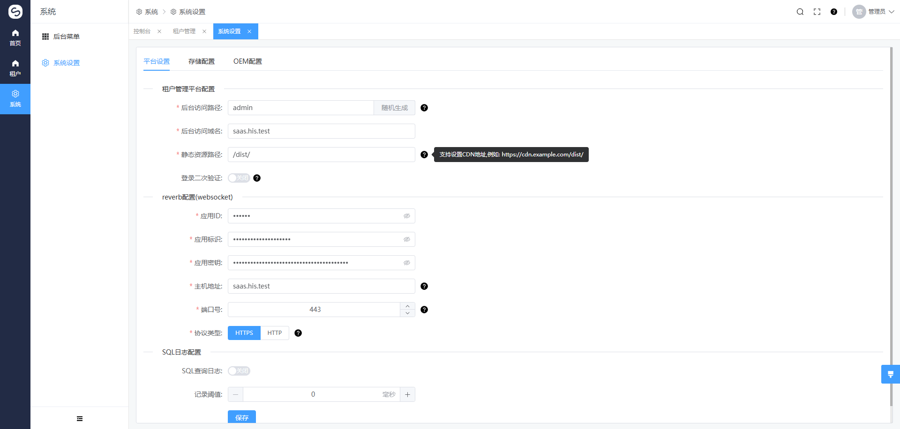
    </td>
    <td width="50%">
      <h3>数据仪表盘</h3>
      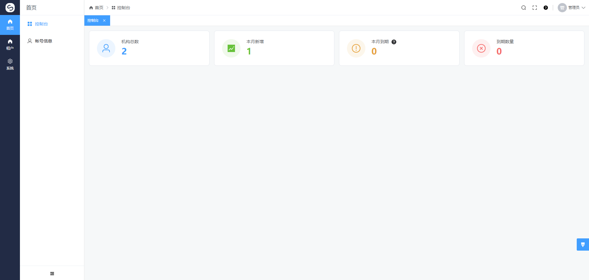
    </td>
  </tr>
  <tr>
    <td width="50%">
      <h3>文件系统</h3>
      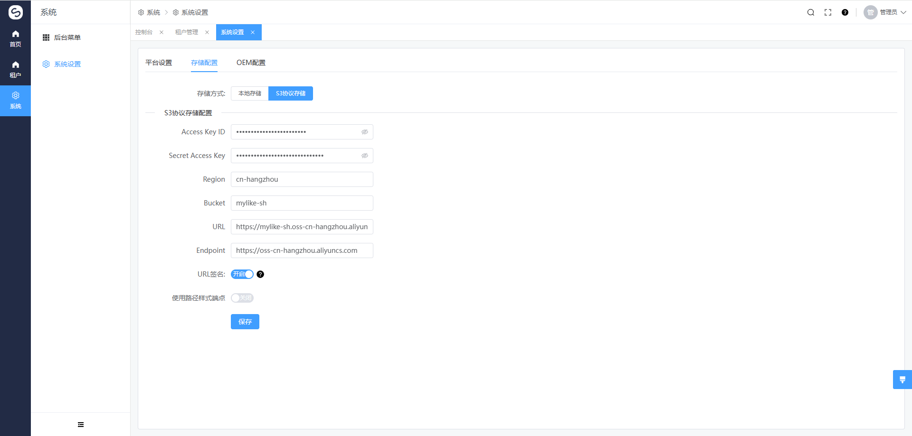
    </td>
    <td width="50%">
      <h3>OEM 定制</h3>
      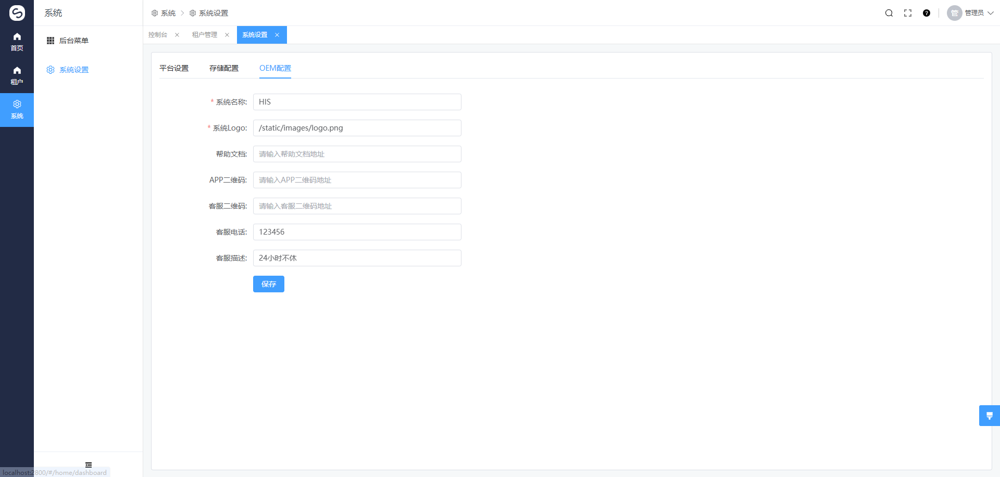
    </td>
  </tr>
  <tr>
    <td width="50%">
      <h3>租户管理</h3>
      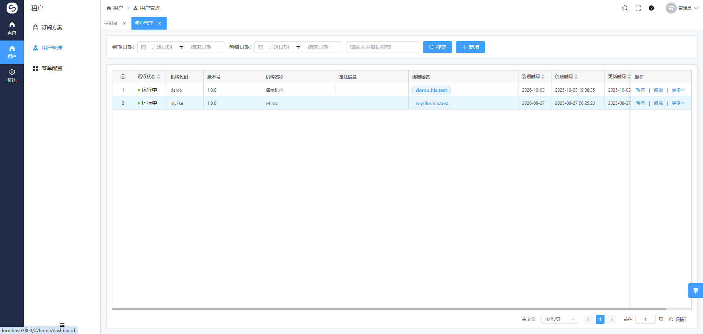
    </td>
    <td width="50%">
    </td>
  </tr>
</table>

---

## 🖼️ 机构端系统截图

<table>
  <tr>
    <td width="50%">
      <h3>登录界面</h3>
      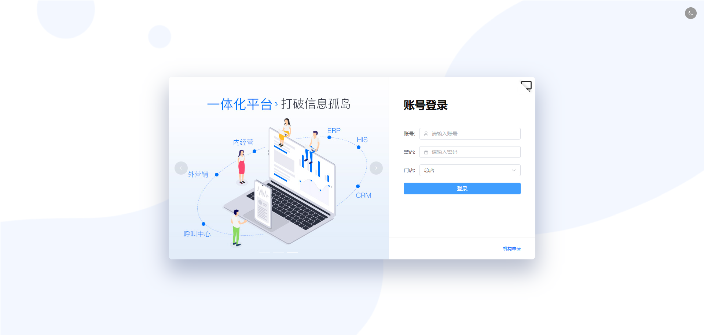
    </td>
    <td width="50%">
      <h3>工作台</h3>
      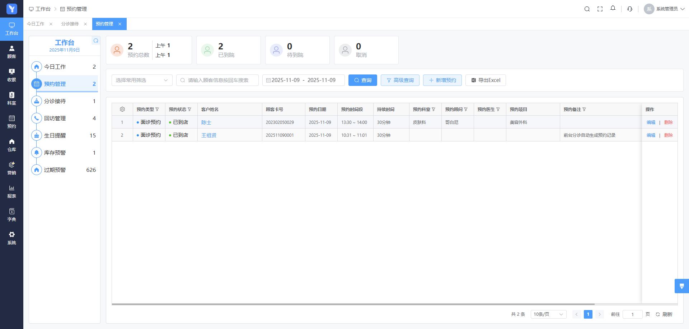
    </td>
  </tr>
  <tr>
    <td width="50%">
      <h3>顶部搜索</h3>
      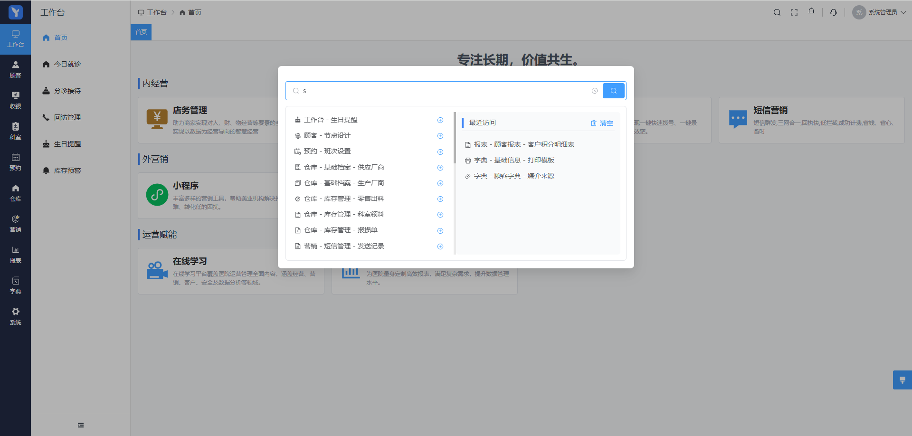
    </td>
    <td width="50%">
      <h3>客户管理</h3>
      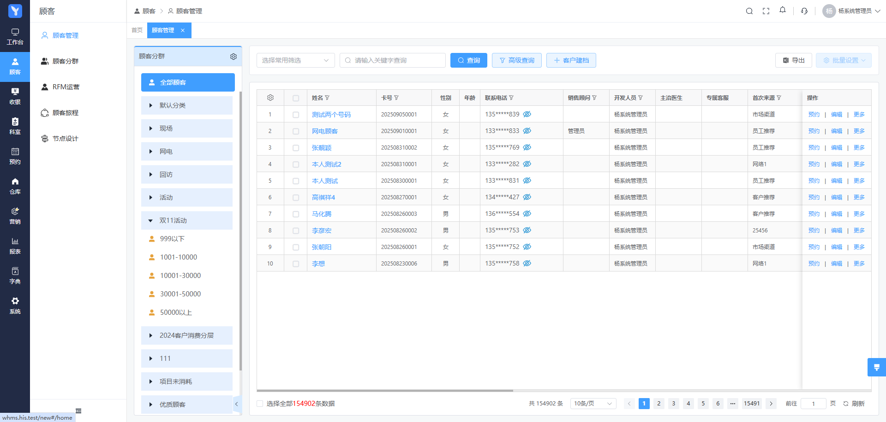
    </td>
  </tr>
  <tr>
    <td width="50%">
      <h3>客户分组</h3>
      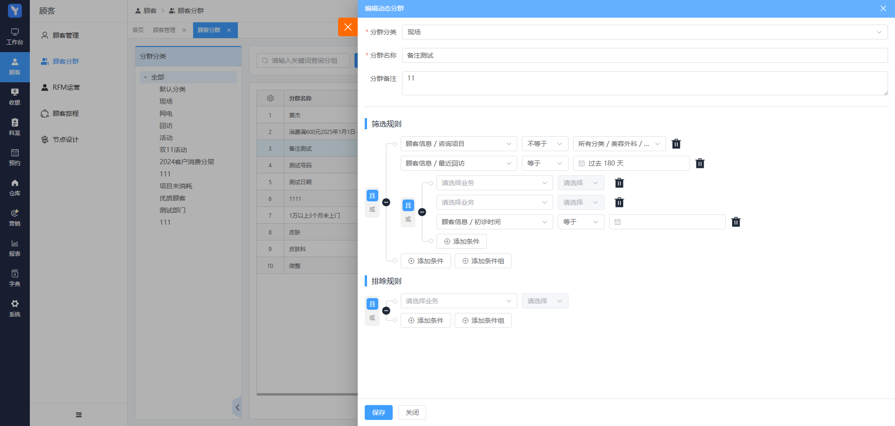
    </td>
    <td width="50%">
      <h3>预约管理</h3>
      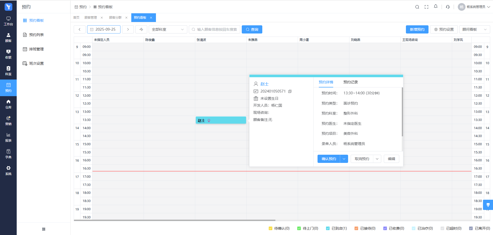
    </td>
  </tr>
  <tr>
    <td width="50%">
      <h3>预约配置</h3>
      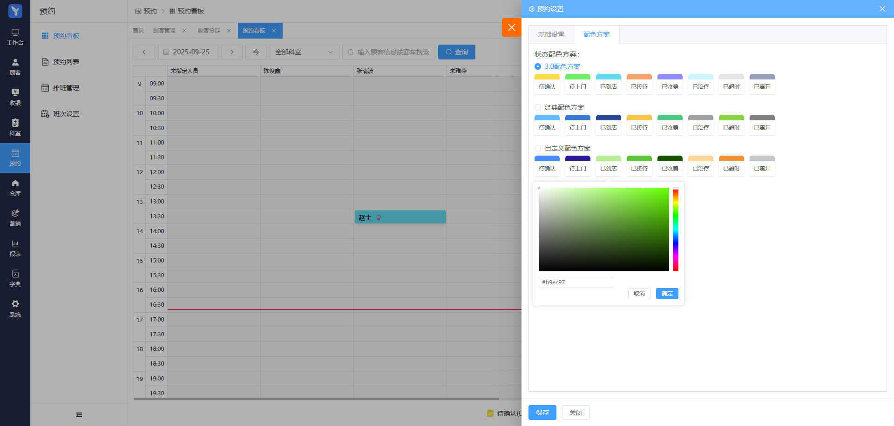
    </td>
    <td width="50%">
      <h3>ERP 管理</h3>
      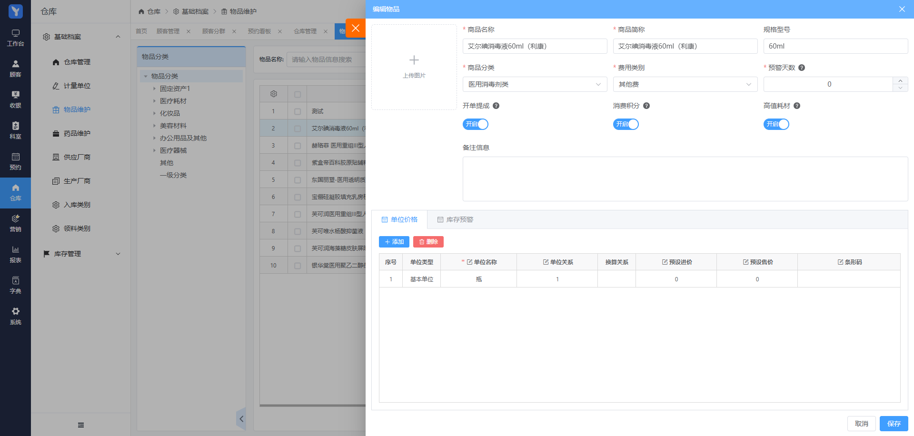
    </td>
  </tr>
  <tr>
    <td width="50%">
      <h3>工作流管理</h3>
      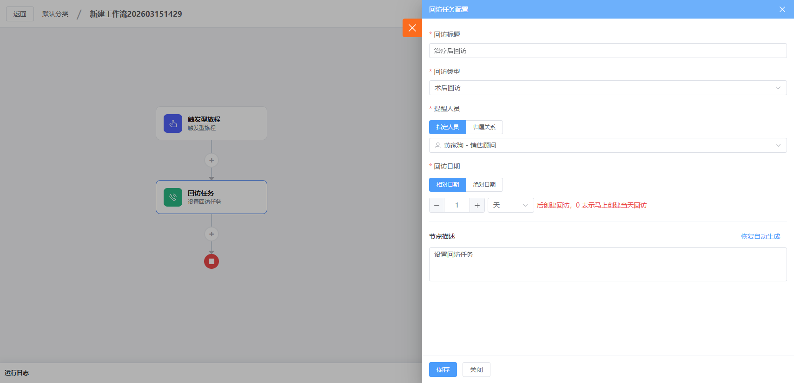
    </td>
    <td width="50%">
    </td>
  </tr>
</table>

---

## 📄 使用协议

本项目使用协议，详见 [LICENSE](LICENSE) 文件。

---
