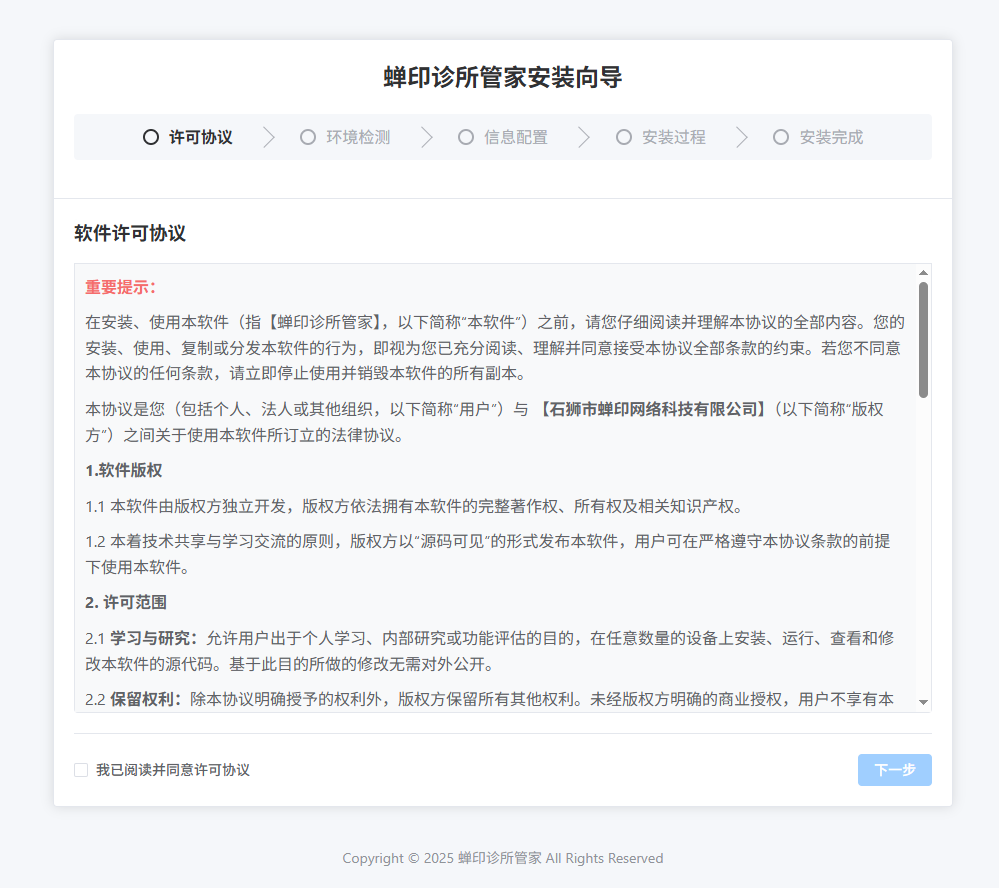
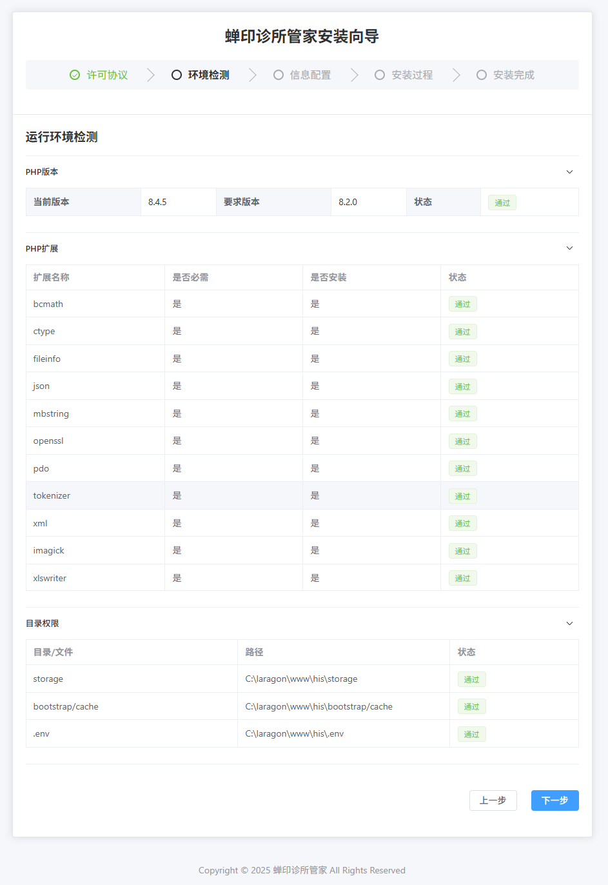
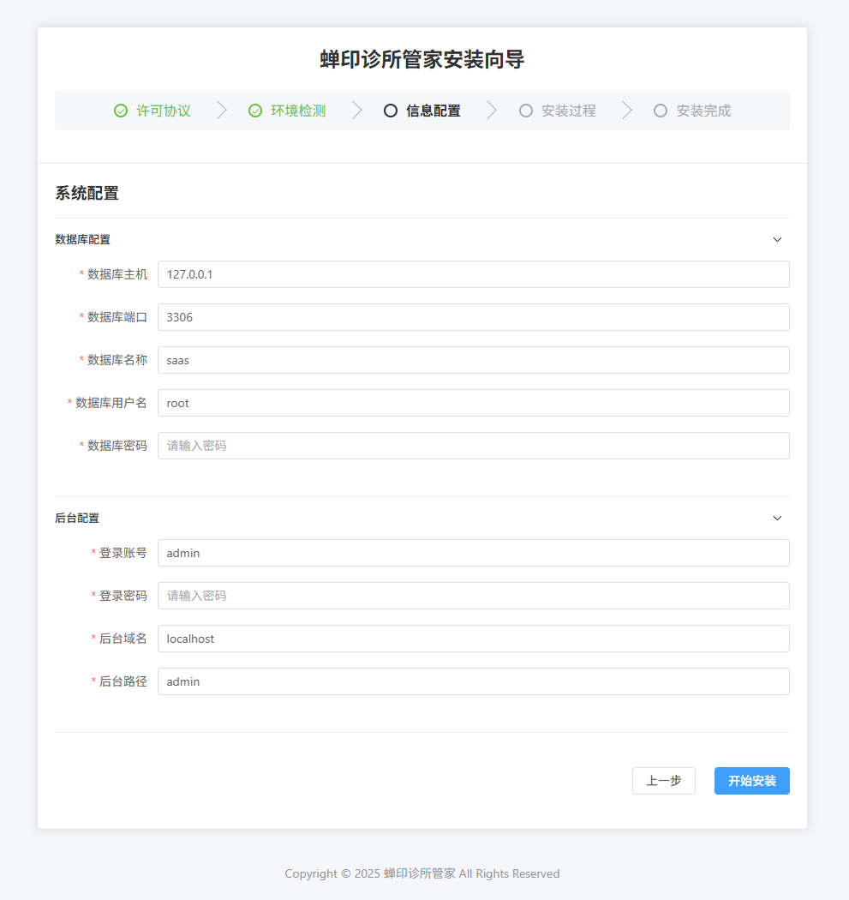

# 蝉印诊所管家系统 - 初始化安装前端

## 项目简介

蝉印诊所管家系统初始化安装前端是一个基于 Vue.js 和 Vite 构建的 Web 应用程序，用于引导用户完成蝉印诊所管家系统的初始化安装配置。

## 功能特性

- 🚀 现代化的 Vue.js 3 框架
- ⚡ 基于 Vite 的快速构建工具
- 📱 响应式设计，支持多设备访问
- 🔧 分步骤的安装向导界面
- ✅ 系统环境检测和配置验证
- 📄 许可协议确认
- ⚙️ 数据库和系统配置
- 🎯 安装完成确认

## 界面预览

以下是系统安装过程的界面截图：

### 安装向导界面


### 配置设置界面


### 安装完成界面


## 安装步骤

本安装前端包含以下核心步骤：

1. **许可协议** (`License.vue`) - 用户阅读并同意软件使用许可
2. **环境检测** (`Environment.vue`) - 检测服务器环境是否满足系统要求
3. **系统配置** (`Config.vue`) - 配置数据库连接和基本系统设置
4. **执行安装** (`Install.vue`) - 执行实际的安装过程
5. **安装完成** (`Complete.vue`) - 显示安装结果和后续操作指引

## 技术栈

- **框架**: Vue.js 3
- **构建工具**: Vite
- **路由**: Vue Router
- **状态管理**: Pinia
- **HTTP 客户端**: Axios
- **样式**: CSS3

## 项目结构

```
src/
├── App.vue                 # 主应用组件
├── main.js                 # 应用入口文件
├── api/                    # API 接口
│   └── install.js          # 安装相关 API
├── assets/                 # 静态资源
│   └── styles/             # 样式文件
├── config/                 # 配置文件
├── router/                 # 路由配置
│   └── index.js            # 路由定义
├── stores/                 # 状态管理
│   └── install.js          # 安装流程状态
├── utils/                  # 工具函数
│   └── request.js          # HTTP 请求封装
└── views/                  # 页面组件
    ├── Complete.vue        # 安装完成页
    ├── Config.vue          # 配置页
    ├── Environment.vue     # 环境检测页
    ├── Install.vue         # 安装执行页
    └── License.vue         # 许可协议页
```

## 开发说明

### 环境要求

- Node.js >= 16.0.0
- npm >= 8.0.0

### 本地开发

```bash
# 安装依赖
npm install

# 启动开发服务器
npm run dev

# 构建生产版本
npm run build

# 预览生产构建
npm run preview
```

### 构建部署

执行构建命令后，生产文件将输出到 `install/` 目录，需要将整个 `install/` 目录复制到 Laravel 项目的 `public/dist/` 目录中完成部署。

## 注意事项

- 本前端应用仅用于系统初始化安装，安装完成后通常不再需要
- 请确保后端安装接口服务正常运行
- 建议在安装完成后删除或移动安装文件以确保系统安全

## 许可证

请参考项目中的许可证文件了解具体的使用条款和限制。

---

**蝉印诊所管家系统** - 让诊所管理更简单、更高效